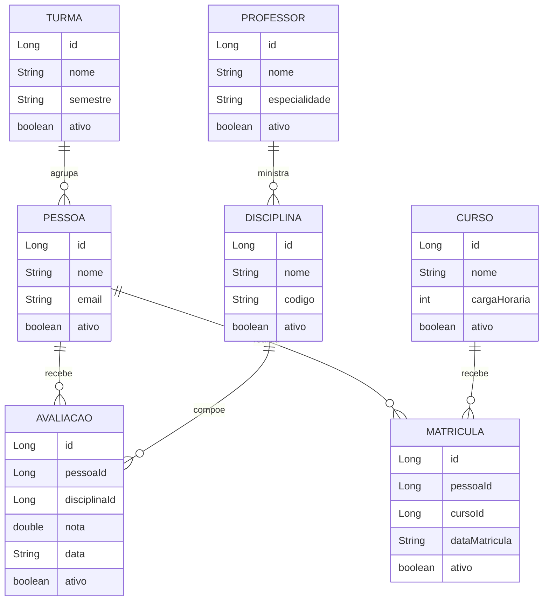

# Sistema Acadêmico — Spring Boot + Microserviços + Angular

Projeto acadêmico fullstack de cadastro escolar com autenticação JWT, arquitetura de microserviços e frontend em Angular.

---

## Sumário

- [Visão Geral](#visão-geral)
- [Arquitetura do Sistema](#arquitetura-do-sistema)
- [Estrutura de Pastas](#estrutura-de-pastas)
- [Tecnologias Utilizadas](#tecnologias-utilizadas)
- [Como Executar](#como-executar)
- [Backend — Monolito de Autenticação](#backend--monolito-de-autenticação)
- [Microserviços](#microserviços)
- [Gateway](#gateway)
- [Frontend](#frontend)
- [Segurança e JWT](#segurança-e-jwt)
- [Endpoints da API](#endpoints-da-api)
- [Diagrama de Entidades](#diagrama-de-entidades)

---

## Visão Geral

O sistema gerencia entidades de um ambiente escolar: **Pessoas, Cursos, Disciplinas, Matrículas, Professores, Turmas e Avaliações**. A aplicação é dividida em três camadas principais:

1. **Backend Monolito** — responsável exclusivamente pela autenticação (registro e login com JWT).
2. **Microserviços** — cada domínio de negócio roda em seu próprio serviço independente.
3. **Frontend** — interface em Angular que consome a API através do Gateway.

Todo o ambiente pode ser iniciado com um único comando via **Docker Compose**.

---

## Arquitetura do Sistema

```
┌────────────────────────────────────────────────────────────────┐
│                        CLIENTE (Browser)                       │
│                      Angular 15 — porta 4200                   │
└─────────────────────────────┬──────────────────────────────────┘
                              │ HTTP + JWT
                              ▼
┌────────────────────────────────────────────────────────────────┐
│                    GATEWAY SERVICE — porta 8080                 │
│              Spring Cloud Gateway + OAuth2 Resource Server      │
│   Valida o token JWT e roteia as requisições para o serviço     │
│                         correto                                 │
└──────┬────────┬────────┬────────┬────────┬────────┬────────────┘
       │        │        │        │        │        │
       ▼        ▼        ▼        ▼        ▼        ▼
  /api/auth  /api/    /api/   /api/   /api/    /api/    /api/
             pessoas  cursos  disci.  profes.  turmas   matr.
       │        │        │        │        │        │        │
       ▼        ▼        ▼        ▼        ▼        ▼        ▼
  ┌────────┐ ┌──────┐ ┌──────┐ ┌──────┐ ┌──────┐ ┌──────┐ ┌──────┐
  │  app   │ │pes.  │ │cur.  │ │disc. │ │prof. │ │turma │ │matr. │
  │  :8090 │ │:8082 │ │:8083 │ │:8084 │ │:8085 │ │:8086 │ │:8081 │
  │  Auth  │ │H2 DB │ │H2 DB │ │H2 DB │ │H2 DB │ │H2 DB │ │H2 DB │
  └────────┘ └──────┘ └──────┘ └──────┘ └──────┘ └──────┘ └──────┘
```

### Fluxo de Autenticação

```
Cliente → POST /api/auth/login → Gateway → Backend (app:8090)
                                               │
                                         Valida credenciais
                                         Gera token JWT (1h)
                                               │
                                    ← retorna { token, role }

Cliente → GET /api/pessoas (Authorization: Bearer <token>)
       → Gateway valida o JWT
       → Encaminha para pessoa-service:8082
       → Retorna dados
```

---

## Estrutura de Pastas

```
crudfullstackSpring/
│
├── backend/                        # Monolito de autenticação (porta 8090)
│   ├── src/main/java/com/exemplo/crudmongo/
│   │   ├── config/                 # SecurityConfig, JwtUtil, JwtFilter
│   │   ├── controller/             # AuthController + todos os controladores REST
│   │   ├── Model/                  # Entidades JPA (Pessoa, Curso, Turma...)
│   │   ├── repository/             # Interfaces JpaRepository
│   │   └── service/                # Lógica de negócio
│   ├── resource/
│   │   └── application.properties  # Configurações H2, JPA, porta
│   └── Dockerfile
│
├── microservicos/
│   ├── gateway-service/            # Roteador central (porta 8080)
│   ├── pessoa-service/             # Gerencia pessoas (porta 8082)
│   ├── curso-service/              # Gerencia cursos (porta 8083)
│   ├── disciplina-service/         # Gerencia disciplinas (porta 8084)
│   ├── professor-service/          # Gerencia professores (porta 8085)
│   ├── turma-service/              # Gerencia turmas (porta 8086)
│   └── matricula-service/          # Gerencia matrículas (porta 8081)
│       └── (chama pessoa-service e curso-service via RestTemplate)
│
├── frontend/                       # Angular 15 (porta 4200)
│   ├── src/app/
│   │   ├── pessoas/                # Módulo de pessoas
│   │   ├── app-routing.module.ts
│   │   └── app.module.ts
│   └── Dockerfile
│
├── diagramas/                      # Diagramas de sequência e entidades (.md)
├── docker-compose.yml              # Orquestração de todos os serviços
└── Dockerfile                      # Build da raiz (referência)
```

---

## Tecnologias Utilizadas

| Camada | Tecnologia | Versão |
|--------|-----------|--------|
| Backend | Spring Boot | 3.2.5 |
| Backend | Java | 17 |
| Backend | Spring Security + JWT (JJWT) | 0.12.5 |
| Backend | Spring Data JPA + H2 | — |
| Backend | SpringDoc OpenAPI (Swagger) | 2.5.0 |
| Backend | JavaFaker (dados de teste) | 1.0.2 |
| Gateway | Spring Cloud Gateway | 2023.x |
| Gateway | OAuth2 Resource Server | — |
| Frontend | Angular | 15 |
| Frontend | TypeScript | 4.8 |
| Infraestrutura | Docker + Docker Compose | — |

---

## Como Executar

### Pré-requisitos

- [Docker](https://www.docker.com/) instalado e em execução
- [Docker Compose](https://docs.docker.com/compose/) disponível

### Subir tudo com Docker Compose

```bash
# Na raiz do projeto
docker compose up --build
```

Aguarde todos os containers iniciarem. Os serviços ficam disponíveis em:

| Serviço | URL |
|---------|-----|
| Gateway (ponto de entrada) | http://localhost:8080 |
| Auth (backend monolito) | http://localhost:8090 |
| Swagger UI (backend) | http://localhost:8090/swagger-ui.html |
| pessoa-service | http://localhost:8082 |
| curso-service | http://localhost:8083 |
| disciplina-service | http://localhost:8084 |
| professor-service | http://localhost:8085 |
| turma-service | http://localhost:8086 |
| matricula-service | http://localhost:8081 |
| H2 Console (auth) | http://localhost:8090/h2-console |

> **Importante:** use sempre a porta **8080** (gateway) para acessar a API no frontend e no Postman. As portas individuais dos microserviços servem apenas para desenvolvimento/debug.

### Executar o frontend localmente (desenvolvimento)

```bash
cd frontend
npm install
ng serve
# Acesse: http://localhost:4200
```

### Usuários padrão (criados automaticamente ao iniciar)

| Usuário | Senha | Role | Permissões |
|---------|-------|------|-----------|
| `professor` | `prof123` | PROFESSOR | CRUD completo |
| `aluno` | `aluno123` | ALUNO | Somente leitura (GET) |

---

## Backend — Monolito de Autenticação

O módulo `backend/` é um serviço Spring Boot independente responsável por:

- **Registro de usuários** (`POST /api/auth/register`)
- **Login e geração de token JWT** (`POST /api/auth/login`)
- **CRUD completo de todas as entidades** (também está disponível aqui, além dos microserviços)

### Banco de dados

Usa **H2 em memória** — os dados são recriados a cada reinicialização com dados fake gerados pelo **JavaFaker**.

### Camadas (padrão MVC)

```
Controller → Service → Repository → H2 (JPA)
```

Cada entidade segue exatamente este padrão:

| Arquivo | Responsabilidade |
|---------|-----------------|
| `Model/Entidade.java` | Mapeamento JPA da tabela |
| `repository/EntidadeRepository.java` | Interface JpaRepository (CRUD automático) |
| `service/EntidadeService.java` | Regras de negócio |
| `controller/EntidadeController.java` | Endpoints REST + controle de acesso por role |
| `config/DataLoader.java` | Popular banco com dados fake na inicialização |

---

## Microserviços

Cada microserviço é um projeto Spring Boot independente com seu próprio banco H2 em memória.

### Comunicação entre serviços

O `matricula-service` é o único que se comunica com outros serviços. Ele usa **RestTemplate** para consultar `pessoa-service` e `curso-service` ao montar uma matrícula detalhada:

```
matricula-service → GET http://pessoa-service:8082/api/pessoas/{id}
matricula-service → GET http://curso-service:8083/api/cursos/{id}
```

A comunicação usa os nomes de serviço definidos no `docker-compose.yml` (resolução DNS interna da rede Docker `microservicos-net`).

### Tabela de serviços

| Serviço | Porta | Endpoint base | Banco |
|---------|-------|--------------|-------|
| gateway-service | 8080 | — (roteador) | — |
| matricula-service | 8081 | `/api/matriculas` | H2 `matriculadb` |
| pessoa-service | 8082 | `/api/pessoas` | H2 |
| curso-service | 8083 | `/api/cursos` | H2 |
| disciplina-service | 8084 | `/api/disciplinas` | H2 |
| professor-service | 8085 | `/api/professores` | H2 |
| turma-service | 8086 | `/api/turmas` | H2 |

---

## Gateway

O `gateway-service` é o **único ponto de entrada** da aplicação para o frontend. Ele:

1. **Valida o token JWT** de cada requisição (via Spring OAuth2 Resource Server)
2. **Roteia** a requisição para o microserviço correto com base no path

### Tabela de rotas

| Path recebido | Encaminhado para |
|--------------|-----------------|
| `/api/auth/**` | `http://app:8090` |
| `/api/matriculas/**` | `http://matricula-service:8081` |
| `/api/pessoas/**` | `http://pessoa-service:8082` |
| `/api/cursos/**` | `http://curso-service:8083` |
| `/api/disciplinas/**` | `http://disciplina-service:8084` |
| `/api/professores/**` | `http://professor-service:8085` |
| `/api/turmas/**` | `http://turma-service:8086` |

---

## Frontend

O frontend foi construído com **Angular 15** e se comunica com o backend exclusivamente através do Gateway (`http://localhost:8080`).

### Estrutura Angular

```
src/app/
├── app.module.ts           # Módulo raiz (importa HttpClientModule, FormsModule, RouterModule)
├── app-routing.module.ts   # Rotas da aplicação
├── app.component.*         # Componente raiz
├── pessoas/                # Módulo de gerenciamento de pessoas
└── pessoas.service.ts      # Service HTTP para /api/pessoas
```

### Padrão de comunicação

```typescript
// O service faz as chamadas HTTP ao gateway
// O token JWT é enviado no header Authorization
this.http.get('/api/pessoas', {
  headers: { Authorization: `Bearer ${token}` }
})
```

---

## Segurança e JWT

### Como o JWT funciona neste projeto

```
1. Cliente envia POST /api/auth/login com { username, password }
2. Backend autentica via Spring Security (UserDetailsService)
3. Backend gera um JWT assinado com HS256:
   - Subject: username
   - Claim "role": PROFESSOR ou ALUNO
   - Expiração: 1 hora
4. Cliente armazena o token e o envia em toda requisição:
   Authorization: Bearer <token>
5. Gateway intercepta, valida a assinatura e extrai a role
6. Microserviços recebem a requisição já autorizada
```

### Controle de acesso por role

| Role | Permissões |
|------|-----------|
| `PROFESSOR` | GET, POST, PUT, DELETE em todas as entidades |
| `ALUNO` | Somente GET (leitura) em todas as entidades |

### Chave secreta JWT

A chave usada para assinar o token é compartilhada entre o `backend` (que gera) e o `gateway-service` (que valida):

```
minha-chave-secreta-super-segura-32bytes!!
```

> Em produção, esta chave deve ser externalizada via variável de ambiente e nunca versionada no repositório.

---

## Endpoints da API

> Todos os endpoints abaixo devem ser chamados via Gateway: `http://localhost:8080`
>
> Exceto `/api/auth/**`, todos requerem o header:
> ```
> Authorization: Bearer <token>
> ```

### Autenticação

#### `POST /api/auth/login`
```json
// Body
{ "username": "professor", "password": "prof123" }

// Response 200
{ "token": "eyJhbGci...", "role": "PROFESSOR" }
```

#### `POST /api/auth/register` *(requer role PROFESSOR)*
```json
// Body
{ "username": "novo", "password": "senha123", "role": "ALUNO" }

// Response 200
{ "message": "Usuario registrado com sucesso" }
```

---

### Pessoas — `/api/pessoas`

| Método | Endpoint | Role |
|--------|----------|------|
| GET | `/api/pessoas` | PROFESSOR, ALUNO |
| GET | `/api/pessoas/{id}` | PROFESSOR, ALUNO |
| POST | `/api/pessoas` | PROFESSOR |
| PUT | `/api/pessoas/{id}` | PROFESSOR |
| DELETE | `/api/pessoas/{id}` | PROFESSOR |

```json
// POST /api/pessoas — Body
{ "nome": "João Silva", "email": "joao@email.com", "ativo": true }
```

---

### Cursos — `/api/cursos`

| Método | Endpoint | Role |
|--------|----------|------|
| GET | `/api/cursos` | PROFESSOR, ALUNO |
| GET | `/api/cursos/{id}` | PROFESSOR, ALUNO |
| POST | `/api/cursos` | PROFESSOR |
| PUT | `/api/cursos/{id}` | PROFESSOR |
| DELETE | `/api/cursos/{id}` | PROFESSOR |

```json
// POST /api/cursos — Body
{ "nome": "Engenharia de Software", "cargaHoraria": 3200, "ativo": true }
```

---

### Disciplinas — `/api/disciplinas`

| Método | Endpoint | Role |
|--------|----------|------|
| GET | `/api/disciplinas` | PROFESSOR, ALUNO |
| GET | `/api/disciplinas/{id}` | PROFESSOR, ALUNO |
| POST | `/api/disciplinas` | PROFESSOR |
| PUT | `/api/disciplinas/{id}` | PROFESSOR |
| DELETE | `/api/disciplinas/{id}` | PROFESSOR |

```json
// POST /api/disciplinas — Body
{ "nome": "Cálculo I", "codigo": "MAT101", "ativo": true }
```

---

### Professores — `/api/professores`

| Método | Endpoint | Role |
|--------|----------|------|
| GET | `/api/professores` | PROFESSOR, ALUNO |
| GET | `/api/professores/{id}` | PROFESSOR, ALUNO |
| POST | `/api/professores` | PROFESSOR |
| PUT | `/api/professores/{id}` | PROFESSOR |
| DELETE | `/api/professores/{id}` | PROFESSOR |

```json
// POST /api/professores — Body
{ "nome": "Ana Lima", "especialidade": "Física", "ativo": true }
```

---

### Turmas — `/api/turmas`

| Método | Endpoint | Role |
|--------|----------|------|
| GET | `/api/turmas` | PROFESSOR, ALUNO |
| GET | `/api/turmas/{id}` | PROFESSOR, ALUNO |
| POST | `/api/turmas` | PROFESSOR |
| PUT | `/api/turmas/{id}` | PROFESSOR |
| DELETE | `/api/turmas/{id}` | PROFESSOR |

```json
// POST /api/turmas — Body
{ "nome": "Turma A", "semestre": "2025.1", "ativo": true }
```

---

### Matrículas — `/api/matriculas`

| Método | Endpoint | Role |
|--------|----------|------|
| GET | `/api/matriculas` | PROFESSOR, ALUNO |
| GET | `/api/matriculas/{id}` | PROFESSOR, ALUNO |
| POST | `/api/matriculas` | PROFESSOR |
| PUT | `/api/matriculas/{id}` | PROFESSOR |
| DELETE | `/api/matriculas/{id}` | PROFESSOR |

```json
// POST /api/matriculas — Body
{ "pessoaId": 1, "cursoId": 1, "dataMatricula": "2025-02-01", "ativo": true }
```

---

### Avaliações — `/api/avaliacoes`

| Método | Endpoint | Role |
|--------|----------|------|
| GET | `/api/avaliacoes` | PROFESSOR, ALUNO |
| GET | `/api/avaliacoes/{id}` | PROFESSOR, ALUNO |
| POST | `/api/avaliacoes` | PROFESSOR |
| PUT | `/api/avaliacoes/{id}` | PROFESSOR |
| DELETE | `/api/avaliacoes/{id}` | PROFESSOR |

```json
// POST /api/avaliacoes — Body
{ "pessoaId": 1, "disciplinaId": 2, "nota": 9.5, "data": "2025-06-10", "ativo": true }
```

---

## Diagrama de Entidades



---

## Documentação Interativa (Swagger)

Com o backend rodando, acesse a documentação interativa dos endpoints em:

```
http://localhost:8090/swagger-ui.html
```

Lá é possível testar todos os endpoints diretamente pelo navegador, incluindo autenticação com JWT.
